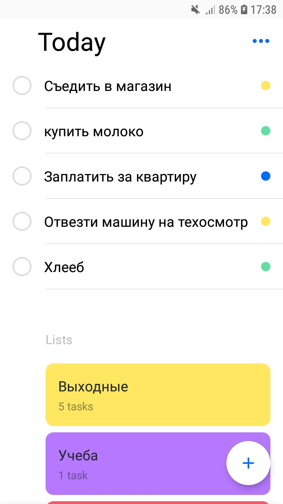
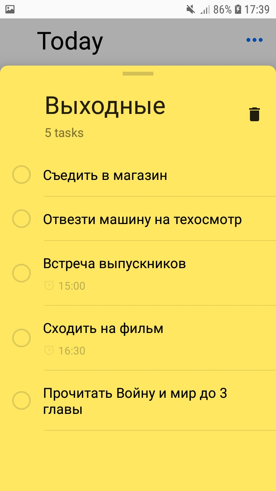
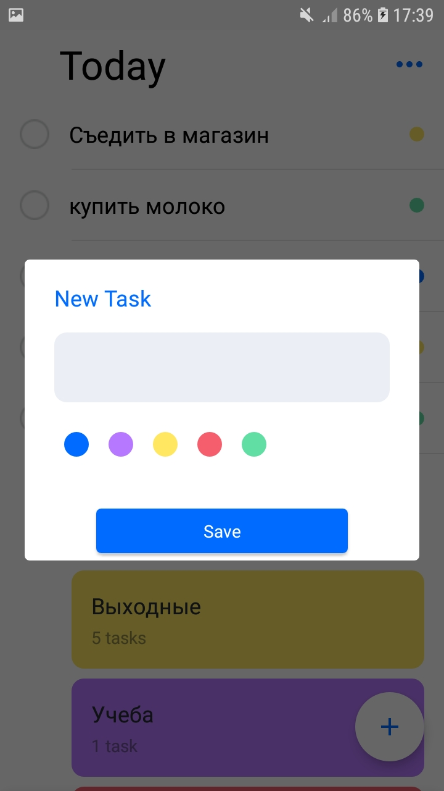
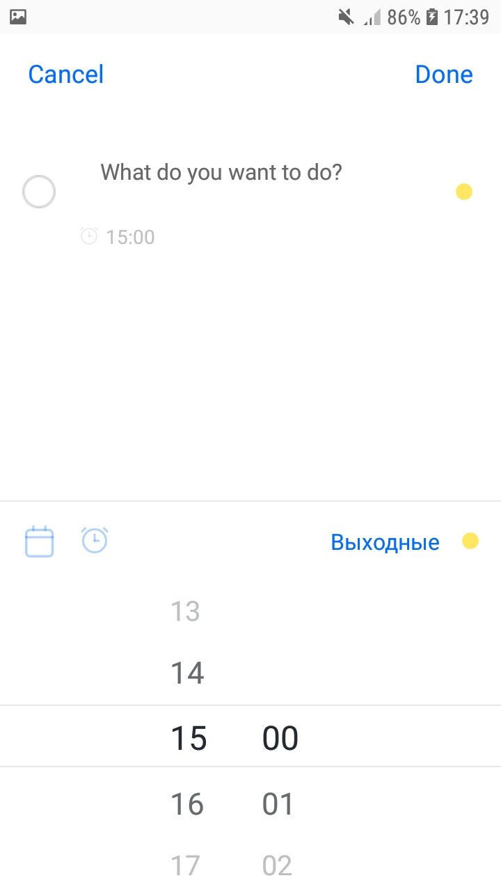
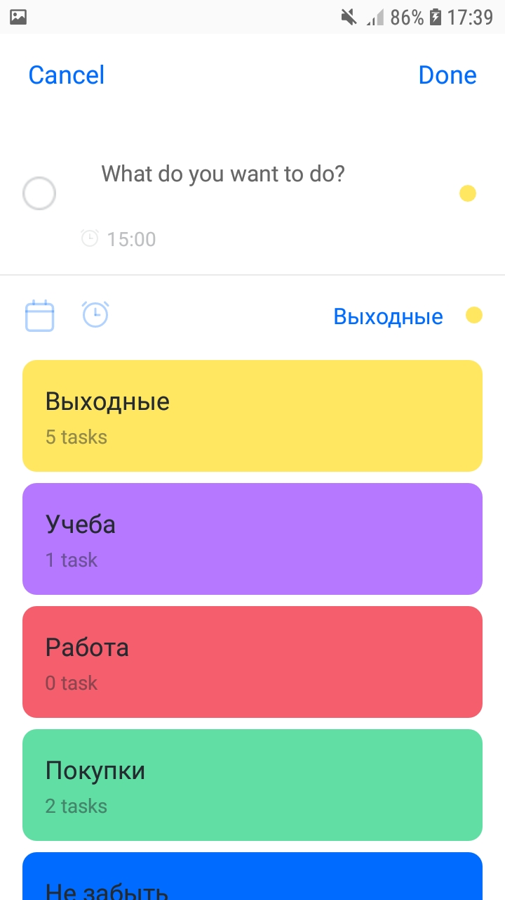

# ToDoTasker
Обычный задачник, имеет функции создавать списки и задачи для списков  

 Вывод всех задач определенного списка 

 Добавление нового списка 

 Добавление новой задачи 

 Назначение задачи на определенное время 

 Добавление задачи в определенный список 

